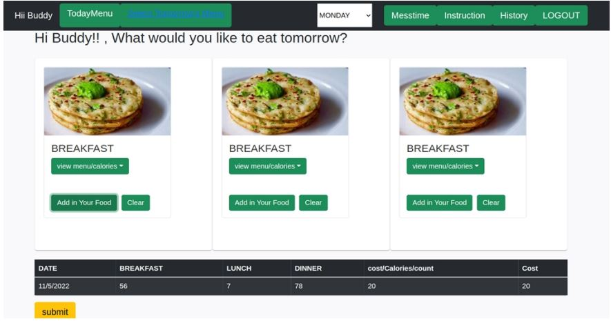
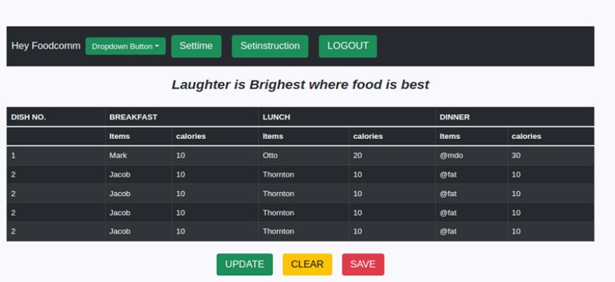
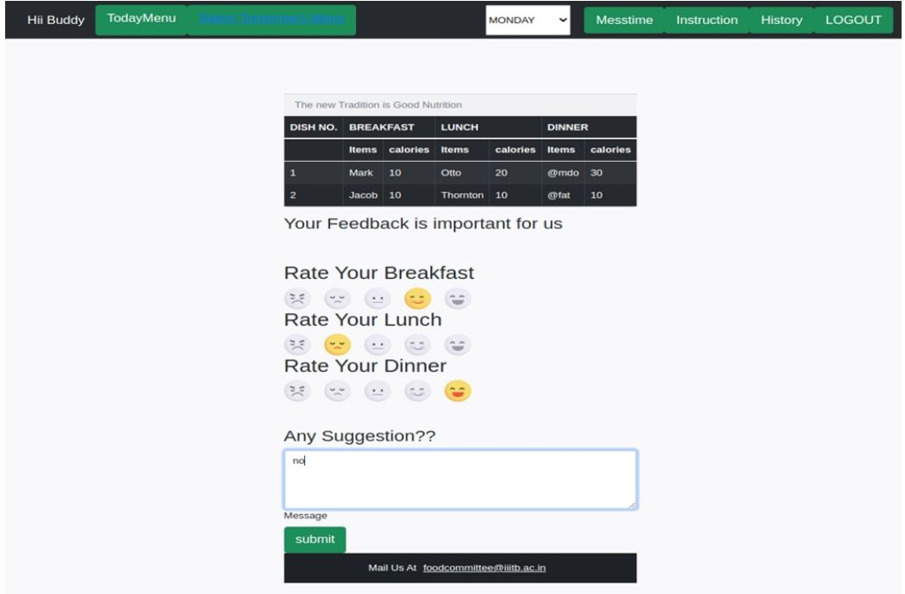
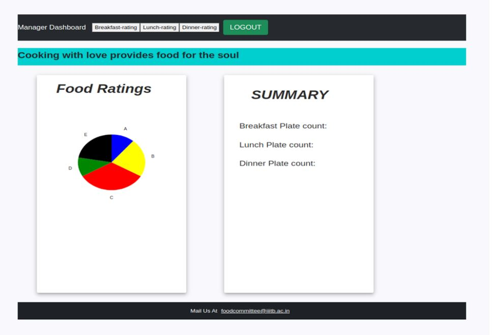
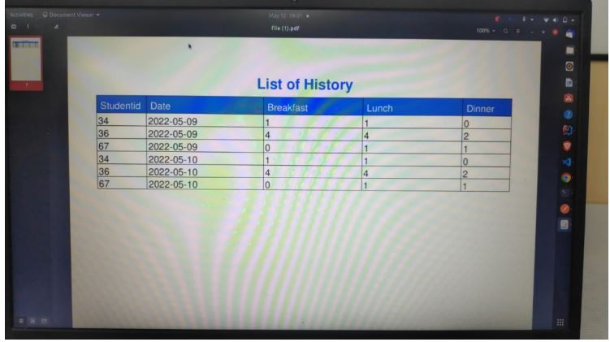
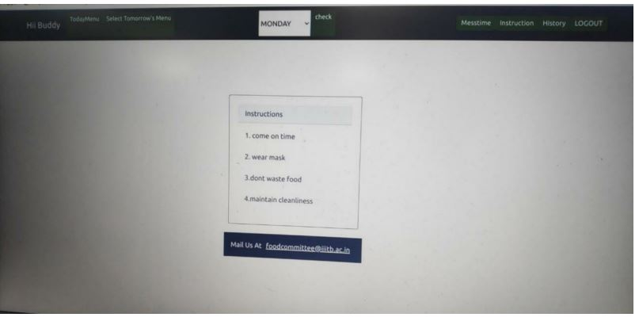
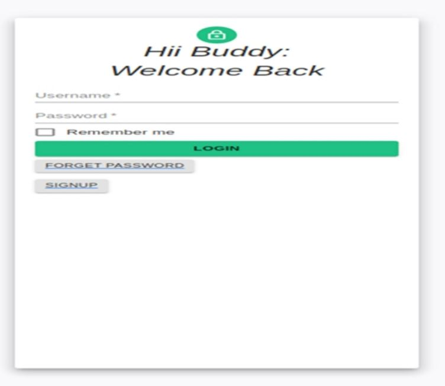
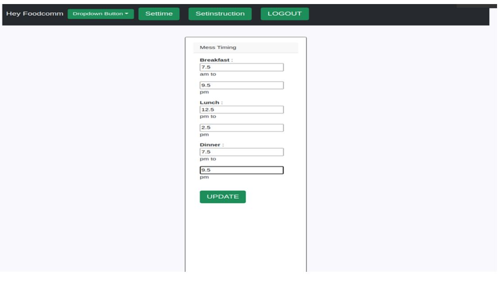

# Mess Management System
A Mess management system is responsible for tracking the food credits of students and their nutritional intake. Due to stress from academics, it is very likely for students to go through either
malnutrition or obesity. Also, to ensure that a student does not intake more food than his/her purchased credits or wasted the credited food by mistake, project mess management system
aims to prevent these problems.
Therefore, project Mess Management System is a web application for local colleges and universities that have strong bias towards nutritional health of their students. There are three entities
namely FoodCom members, Mess managers and students who can register themselves on the web portal. Students can view their calories intake as per the given mess menu.
This project is useful for those universities and colleges who prefer to have a strict credit based system for meal expenses and are highly biased towards taking care of Student’s diets.

The architecture of our project have two layers.

• Front end

• Back-end

The application is using “React” as Frontend framework (which is actually a library in JavaScript but
is as powerful as a framework), The Backend is handled by “Spring” which communicates with
MySql database.
# Features

 Login - Login page for students, mess managers and foodcom members to authenticate themselves

 Signup -Signup page for students to sign up themselves.

 History- Mess manager and foodcom members can view history of credits spent by students and their calories intake.

 Logout – to sign out

 dashboard - To view today`s menu and set tomorrow’s menu

 Instructions-Mess managers can set special instructions for a specific day and students can view them

 Mess timings-Mess managers can set new timings for mess

 Ratings-Students can rate food

## Screenshots
The food menu/dashboard allows students to select whatever food is present in the database


Shows a history of credits spent and intake calories of all students on a particular day


A student can rate his/her experience with the mess food.


Foodcom members and mess managers can check food ratings:


Mess managers can view students overall credits.


Students can view instructions given by foodcomm or mess manager members.


Login page:


UPDATING MESS TIMINGS:
A mess manager can change the mess timings:



## API Docs


```http
  POST /postrating
```

| Input     | Type    | Description              |
| :-------- | :------- | :------------------------- |
| `Studentid`,`date`,`breakfast`,`lunch`,`dinner`,`breakfastrating`,`lunchrating`,`dinnerrating`,`feedback` | `string` | submit food rating to foodcom |


```http
  GET /getrating/{id}
```

| Parameter | Type     | Description                       |
| :-------- | :------- | :-------------------------------- |
| `id`      | `string` | fetch the rating of a specific day |

```http
  GET /getMesstime
```

| Parameter | Type     | Description                       |
| :-------- | :------- | :-------------------------------- |
| None      | None | Fetch the mess timings from the database |

```http
  GET /getInstruction/{id}
```

| Parameter | Type     | Description                       |
| :-------- | :------- | :-------------------------------- |
| `id`     | `string` | Fetch the mess timings from the database |

```http
  GET history/{id}
```

| Parameter | Type     | Description                       |
| :-------- | :------- | :-------------------------------- |
| `id`     | `string` | Fetch the history of meals  |

```http
  GET /getTodaymenu
```

| Parameter | Type     | Description                       |
| :-------- | :------- | :-------------------------------- |
| None      | None  | Fetches today’s menu  |


```http
  GET /getCountplates
```

| Parameter | Type     | Description                       |
| :-------- | :------- | :-------------------------------- |
| None      | None  | Fetches the count of plates |


```http
  GET getRating/{id}
```

| Parameter | Type     | Description                       |
| :-------- | :------- | :-------------------------------- |
| `id`     | `string` | Fetches the rating given by students  |

```http
 PUT /updateTime/{id}
```

| Parameter | Type     | Description                       |
| :-------- | :------- | :-------------------------------- |
| `Id`,`breakfastin`,`breakfastout`,`lunchin`,`lunchout`,`dinnerin`,`dinnerout`| `string` | Updates the timings of mess |


```http
  POST /updateMenu
```

| Parameter | Type     | Description                       |
| :-------- | :------- | :-------------------------------- |
| `Days`,`breakfast`,`lunch`,`dinner`     | `string` | Updates the menu for week  |

```http
  PUT /updateInstruction/{id}
```

| Parameter | Type     | Description                       |
| :-------- | :------- | :-------------------------------- |
| `Id`,`instruction1`,`instruction2`,`instruction3`,`instruction4`    | `string` | Updates the instructions   |

```http
  POST /postplatecount
```

| Parameter | Type     | Description                       |
| :-------- | :------- | :-------------------------------- |
| `Studentid`,`breakfast`,`lunch`,`dinner`     | `string` | Returns count of plates after meals  |


Id can be represneted as 1 for breakfast,2 for lunch,3 for dinner.
